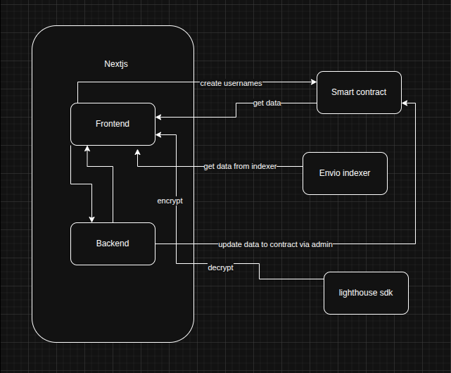

# SealEncrypt

**SealEncrypt** is a decentralized encrypted document storage and permission based sharing platform, where users can give access to a file or revoke access using simple signatures with simplified usernames.

---

## 🌐 Deployment Links

- **Smart Contract (Sepolia):** [View on Etherscan ↗](https://sepolia.etherscan.io/address/0x871395f42AD3dd854EbBd29940e737282bc3395E)
- **Web App:** [Seal Encrypt ↗](https://seal-encrypt.vercel.app)
- **Envio Indexer:** [Envio indexer ↗](https://indexer.dev.hyperindex.xyz/665a790/v1/graphql)
---

## 🛠 Tech Stack

- **Frontend:** Next.js, Tailwind CSS, Framer Motion
- **Smart Contracts:** Sepolia (using Hardhat)
- **Storage:** IPFS (encrypted via Lighthouse sdk)
- **Utilities:** Wagmi, Viem, RainbowKit for wallet and contract interactions
- **Indexer:** Envio for real-time blockchain data indexing
- **Free LLMs** Usage of free llms to make the frontend like Chatgpt, Claude, and Gemini Flash

---

## 🚀 Getting Started

### Build and Test Smart Contracts

```bash
npm install
npx hardhat build
npx hardhat test
```

### Store private key securely and deploy Smart Contracts

```bash
npx hardhat keystore set SEPOLIA_PRIVATE_KEY
npx hardhat ignition deploy --network sepolia ignition/modules/SealEncrypt.ts
```

### Update etherscan api key in .env.example and verify Smart Contracts

```bash
mv .env.example .env
npx hardhat verify --network sepolia <CONTRACT_ADDRESS>
```

---

### Run the envio indexer locally

```bash
cd envio-indexer
npm install
npm run dev
```

once done close the envio indexer using `npx envio stop`

---

### Update the .env.example with variable and install dependencies for frontend

```bash
mv .env.example .env
cd web
npm install
npm run dev
```

---

## 🏗️ Architecture Overview




- **Client-Side Encryption & IPFS**: Files are encrypted directly on the client device before being uploaded to IPFS, ensuring that only the owner retains control over the data.

- **Share & Revoke Access (Username-Based)**: Documents can be securely shared using usernames as well as wallet addresses, simplifying access control.
  Users can grant or revoke access at any time with a simple signature.

- **Signature-Based Decryption**: Only the document owner or authorized recipients can decrypt files using their on-chain wallet signature, maintaining complete end-to-end security.

- **Real-Time Monitoring via Envio Indexer**: The Envio Indexer tracks on-chain events, providing live updates for actions like uploads, shares, and revocations directly within the app.

- **Scalable Storage Model (Future Update)**: Planned integration of a pay-per-storage model — for example, **$1 USDC per 10 GB of encrypted data** per user — enabling sustainable and decentralized data management.

---

## Pages Overview

- **🏠 Home (`/`)**
  The landing page introducing **SealEncrypt** - featuring a hero section, animations, and a quick overview of the platform’s core features.

- **📊 Dashboard (`/dashboard`)**
  Displays the user’s documents, status badges, and quick actions.
  Includes username creation and update functionality with synced user data.

- **📤 Upload (`/upload`)**
  Allows users to upload files with **client-side encryption** before storing metadata on-chain via smart contracts.

- **📁 Your SealEncrypts (`/documents`)**
  Lists all user documents with detailed file metadata — including CID, share/revoke access controls, and decryption options.

- **🔐 Decrypt (`/decrypt`)**
  Enables users or authorized recipients (with granted access) to decrypt documents using their **wallet signature**.

- **🧾 Transaction Logs (`/tx-logs`)**
  Displays recent on-chain transactions and activity data fetched in real-time through the **Envio Indexer**.

---

## 🧾 License

This project is licensed under the **MIT License** — see the [LICENSE](./LICENSE) file for details.
